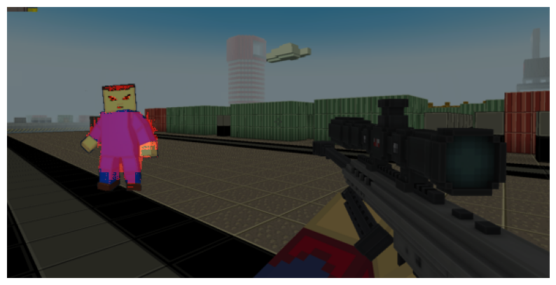
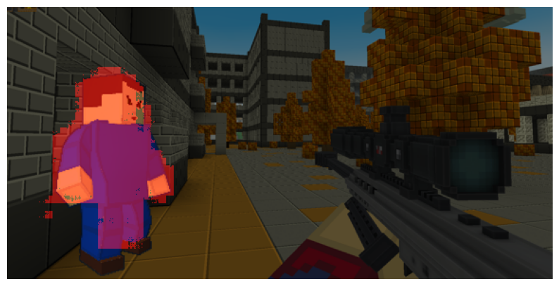
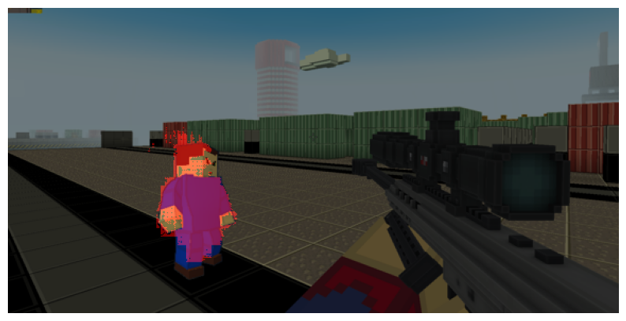
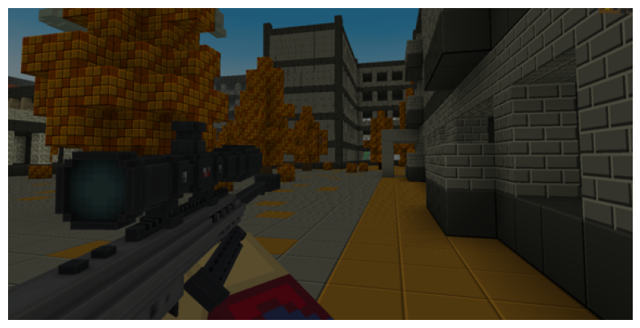
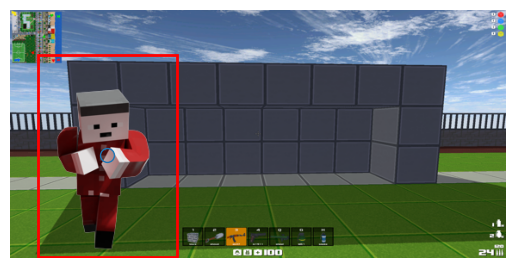
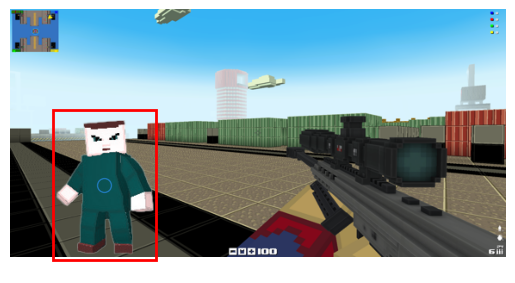
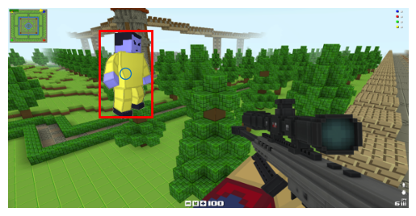
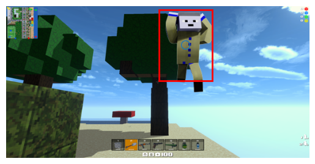

# 🎯 Blockade_aimbot
***Designed by MrPioSmasher for MrPio smashing. 🦆***  
   
A computer vision pipeline that performs real-time player detection and automated targeting in [Blockstorm](https://github.com/MrPio/Blockstorm). Built entirely from scratch as a deep learning research and experimentation project.  

This is an improved version of [this earlier attempt](https://github.com/MrPio/BlockadeAimbot).

---

## ✅ Features

| Functionality                | Status |
| -----------------------------|:------:|
| Image segmentation           |   ✔️    |
| Bounding box detection       |   ✔️    |
| Head detection               |   ✔️    |
| Mouse movement               |   ✔️    |
| Testing                      |   🔳    |

---

## 🧠 Architecture

The project features two modes: image segmentation or bounding box detection. In both cases, the model was trained from scratch.

### 1. Segmentation — U-Net
A **U-Net** architecture trained to segment the game screen and detect opponent pixels. Since it performs pixel-level classification, it is more accurate, but slower.

### 2. Bounding Box Detection - YOLO-inspired
A **simplified, custom YOLO-like architecture** trained to detect bounding boxes around players. It is lightweight and optimized for high frame-rate.

In both cases, a simple algorithm is used to detect the head's likely position, starting from the model outputs.

## Screenshots

