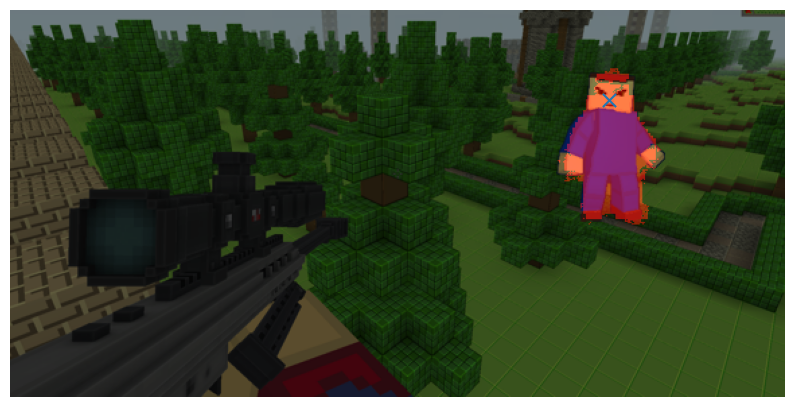
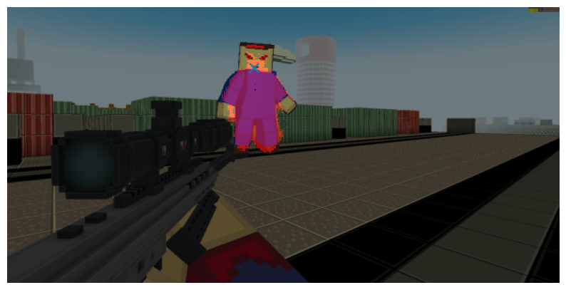

# Blockade_aimbot
***Designed by MrPioSmasher for MrPio smashing.***  
   
An attempt to create an aimbot for a game starting from in game screenshots.

| Functionality                | Status |
| -----------------------------|:------:|
| Image segmentation           |   🔲    |
| Head detection               |   ✅     |
| Mouse movement               |   🔳    |

## Screenshots

